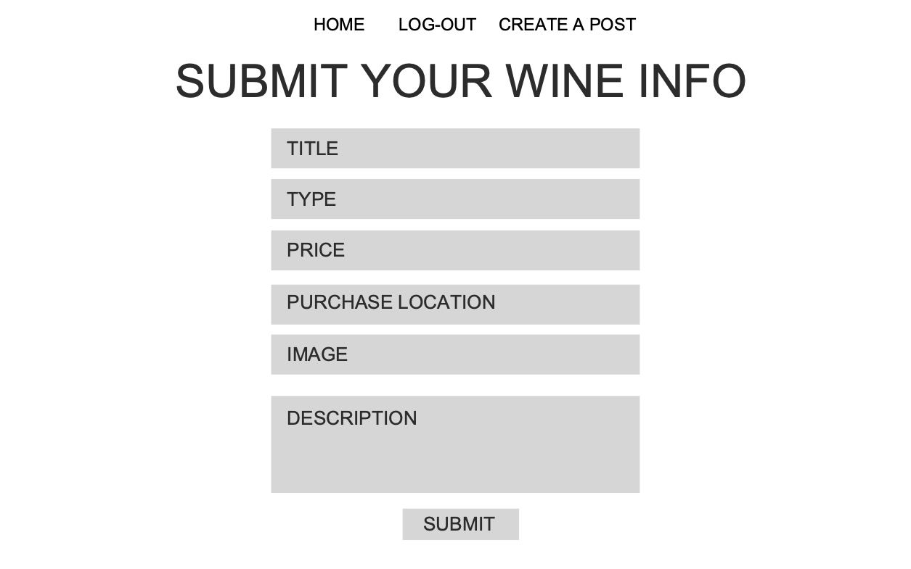

# Wine Talk App

## Summary:
This app will allow users to post wines that have enjoyed or not enjoyed. It will allow them to post name, price, type, where they bought and what they think or tasting notes(description). Also, as a part of the app the users will be able to comment on the posts.

## User Stories:
* When page loads the user will see the options to log-in and logout.
* On load there will also be post/wine titles which are links
* If use clicks on log-in they will be direct to log-in form(once logged on they be direct back to home page)
* If they click on sign-up they will be directed to a sign-up form (once signed up they will be direct to home page)
* Once logged in they will see all post links and will also see the option to go home, for when they are at wine detail, and a create post option
* If they click on create a post/wine they will be directed to a create wine form. When they submit the form they will be direct to the home page where their post will be on top
* If a use clicks on a wine title they will be direct to wine detail page
* At the wine detail page they will see the name, type, price, purchase loaction, an image, wine details and all the comments below.
* If they are logged in they will see a button to add a comment
* If they click the button they will be directed to a comment form where they can add title and comment for post
* When they submit they will be directed back to wine they were commenting on
* If they are logged in they will see all the same details as logged out, but will only see buttons to log-in or sign-up if they want to leave a comment
* User can edit any wines they posted, will direct them to edit form. Once submited they will be directed to wine detail
* User can delete any wines they posted. Once deleted they will be directed to home page

## Wireframes:

## ERD:

## Routes:
### User Routes
VERB | PATH | SUMMARY
-----|------|--------
POST | /    | create user
POST | /login   | user login
GET | /verify   | grab user from db
### Wine Routes
VERB | PATH | SUMMARY
-----|------|--------
POST | /    | create wine
GET | /allwines   | get all the wines
GET | /verify/:id   | grab one wine
POST | /verify/:id/comment   | create comment
PUT | /verify/:id/edit   | edit wine
DELETE | /verify/:id/delete   | delete wine
## MVP's:
1. User can sign-up
1. User can log-in
1. User can log-out
1. User can see all wines on load (wines titles are links)
1. Use can click on wine and be directed to wine detail
1. Navigate between all wines, wine detail and create wine
1. Wine detail will pull up all wine details
1. Logged in user can leave comment on wine
1. Logged in user can edit wines they post
1. Logged in user can delete wine they post
1. User not able to see comment, create wine, edit wine, or delete wine buttons if not logged in
1. Password hashing, user encryption, and unique email for sign-up
1. Basic CSS (components not on top of each and in tidy fashion)

## Stretch Goals
1. Can search by various wine details
1. Add catergories based on type, purchase location, price
1. Additional CSS to make it look more real world app
1. Turn all forms into modals

